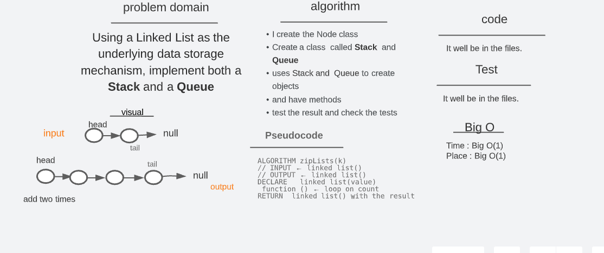
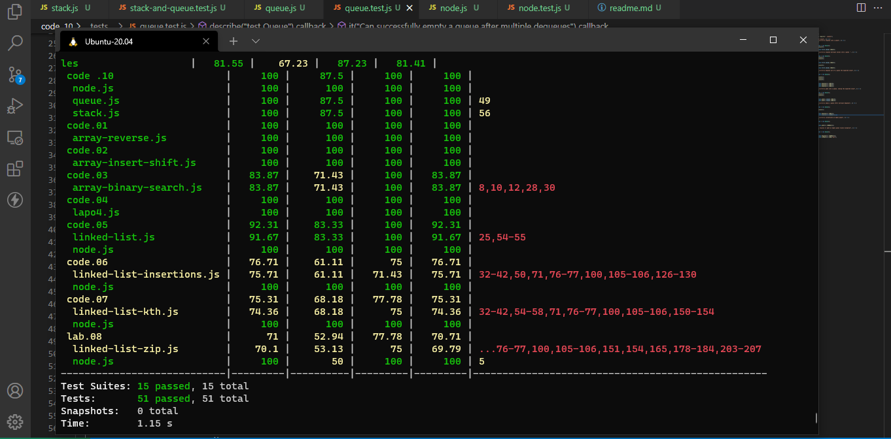

# **Stack** and a _Queue_ Implementation (code challenge _10_)

## Challenge

[code_challenge_401](https://github.com/mr-atta/code_challenge_401)

- Implement a **Stack** and a **Queue**, By using a _Linked List_ as the underlying data storage mechanism.

## witghbord

## test code

- Run tests with :
  - npm test

## time: O(1)

## space: O(1)

## API

- Create Node and two LinkedList Classes for Stack and Queue.

- Within your Linked List (Stack) create a method (push, pop, peek, isEmpty).

- Within your Linked List (Queue) create a method (enqueue, dequeue, peek, isEmpty).

- Use the method on Stack and Queue.
- Do tests to check the code

## Approach & Efficiency

- Read the lab and understand the problem domain "Using a Linked List as the underlying data storage mechanism, implement both a Stack and a Queue"

- Thinking and search how to solve and deal with this issue

- creat Node class to generate our object
- creat queue and stack classes to create objectes useing Node class

- Start writing the code

- Testing the code by comber the result from the methodes

 

### stack

- push(value) : adds a new node with that value to the top of the stack with an O(1) Time performance.
- pop() : Removes the node from the top of the stack

### queue

- enqueue(value) : adds a new node with that value to the back of the queue with an O(1) Time performance.
- dequeue() : Removes the node from the front of the queue
- peek() : Returns the Value of the node located at the front of the queue
- isEmpty() : Returns a boolean indicating whether or not the queue is empty

> Time taken :: 40 min
