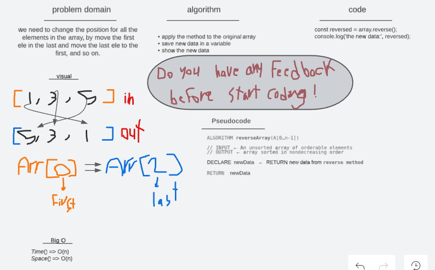

# Reverse an Array 01

## Approach & Efficiency

- The challenge is to reverse the contents of the array.
- Using the whiteboard to plan work before started.
- Wright Problem Domain, Visual, Algorithm, Pseudocode.
- Then start codeing
- Test the code.
- I take some time and faced problems because I am not familiar with using the whiteboard yet.

 

## Whiteboard and Process

