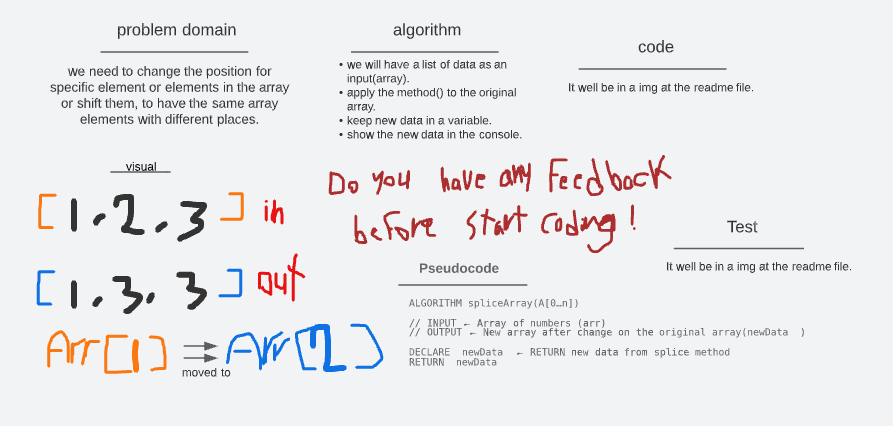

# Insert and shift an array 02

## Whiteboard Process

## Approach & Efficiency

- The challenge is to edit and change the places of the array elements.
- Using the whiteboard to planing before work.
- Wright Problem Domain, Visual, Algorithm, Pseudocode.
- used Array.splice() method to apply the changes on the array.
- Test, I test the code in replit to check the result.

 

- this assignment took 60 min .
