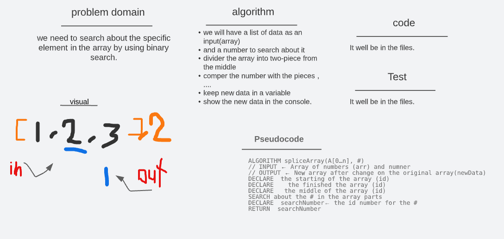

# Binary Search of Sorted Array

### Whiteboard Process

> 

- Write a function called **BinarySearch** which takes in 2 parameters: a sorted array and the search key. Without utilizing any of the built-in methods available to your language, return the index of the array’s element that is equal to the value of the search key, or -1 if the element is not in the array.

### Approach & Efficiency

- Define the variables we need
- prepare the function
- diagram the functionality the code
- prepare the input array to test

 

- **time** 9:20 >>>>
