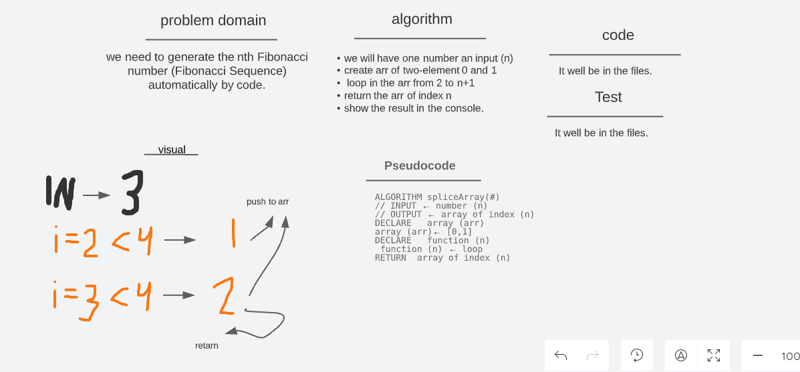

# code challeng 04

- Generate the nth Fibonacci number, 2 different ways.

## Whiteboard Process

## Approach & Efficiency

- Define the input we need
- Define the array we will use
- prepare the function
- prepare the loop
- diagram the functionality the code
- prepare the input array to test (npm test)
