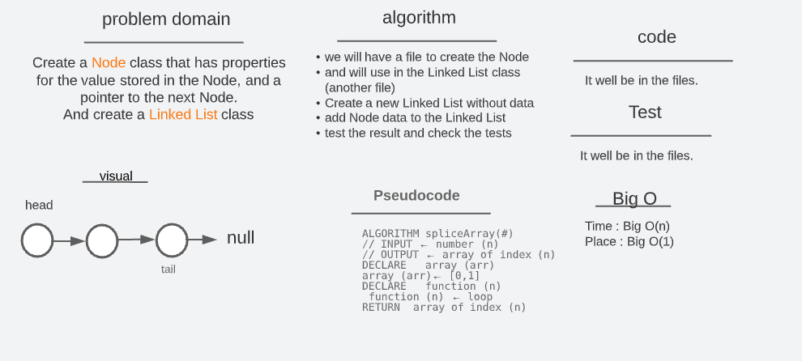

# code challenge 05

# linked-list

## Whiteboard and Process

# Singly Linked List

#### A singly linked linear list is a recursive data structure, because it contains a pointer to a smaller object of the same type

## Challenge

- Creat new and new Implementation of Linked List as : `"{ a } -> { b } -> { c } -> NULL"`

## Approach & Efficiency

- Create a Node class that has properties for the value stored in the Node
- Create a Linked List class
- Within your Linked List class, include a head property
- The class should contain (insert, includes, to string) method

## API

- insert() >>> take a value to add a new node to the list
- include() >>> to check if the value is in the list or not, return Boolean
- toString >>> a string representing all the values in the Linked List , return string
