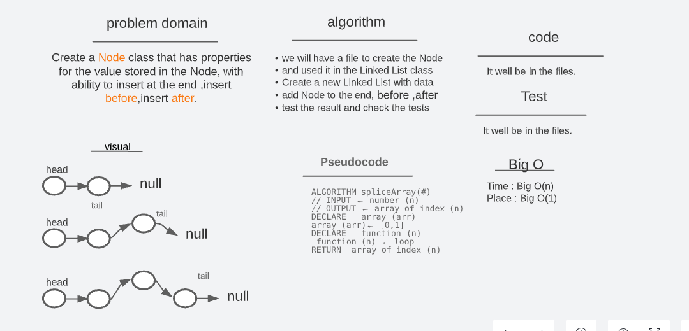
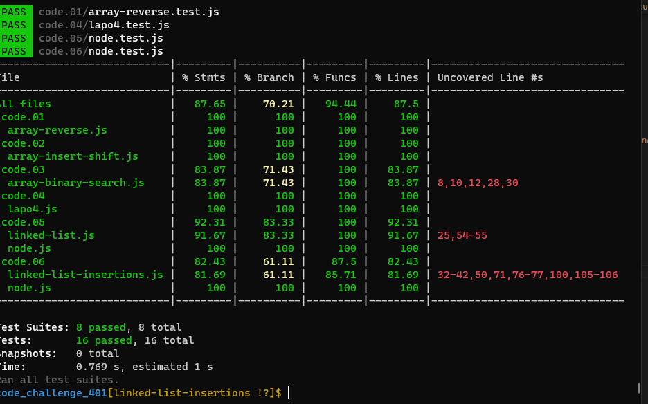

# linked-list-insertions (lab 06)

## Whiteboard and Process

## test result

## Challenge

- Create a Node class that has properties for the value stored in the Node, with ability to insert at the end ,insert before,insert after.

## Approach & Efficiency

- Create a Node class that has properties for the value stored in the Node
- Create a Linked List class
- Within your Linked List added data then added to the last of the list
- create functions to insertBefore and insertAfter
- The class should contain (insert, includes, to string) method
