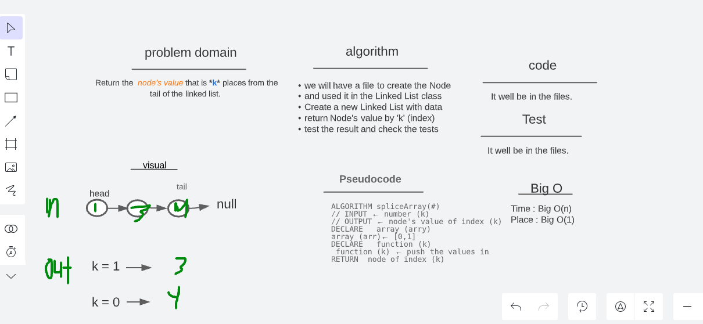
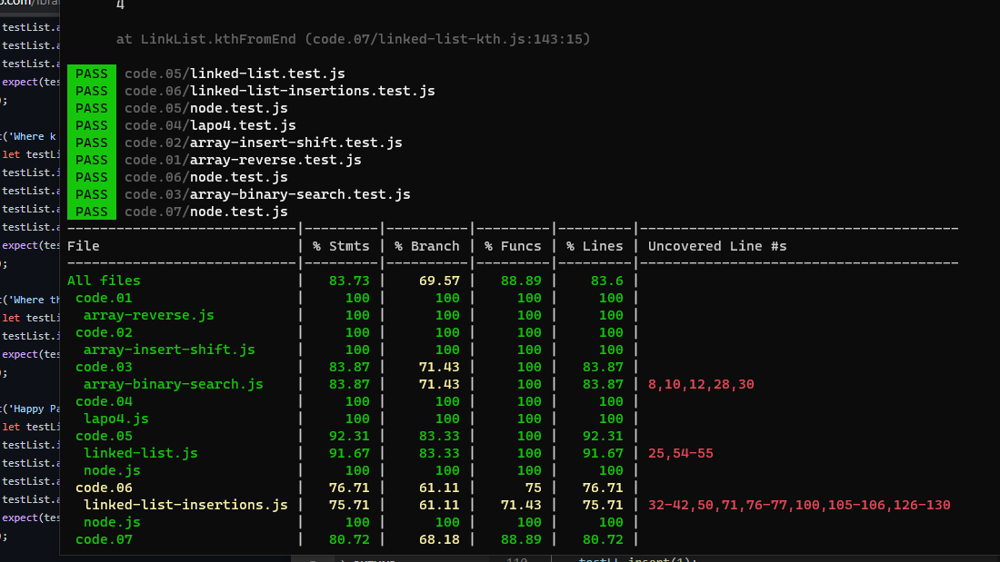

# linked-list-kth (lab 07)

## Challenge

- Return the _node’s value_ that is **k** places from the tail of the linked list.

## Whiteboard and Process

## test result

## Approach & Efficiency

- Create a Node class that has properties for the value stored in the Node
- Create a Linked List class
- Within your Linked List added data then added to the last of the list
- return the node's value of the index k
- by kthFromEnd method in the class
