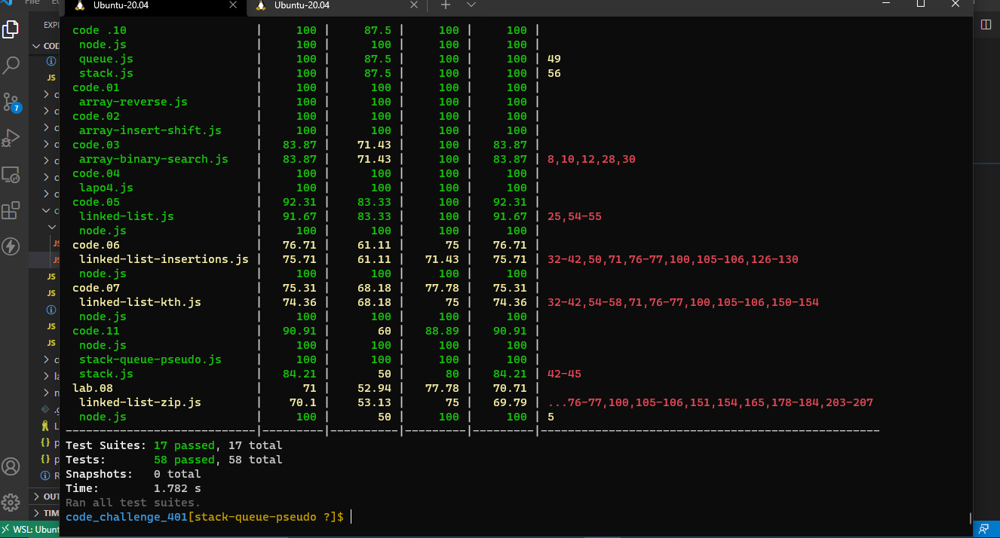

# Stack Queue Pseudo (lab 11)

[code_challenge_401](https://github.com/mr-atta/code_challenge_401)

### Code Challenge :

- Implement a Queue using two Stacks.

 

## Approach & Efficiency

- Read the lab and understand the problem domain "Implement a Queue using two Stacks."

- Thinking and search how to solve and deal with this issue

- Start writing the code

 

- I create a class 'Node' I will use it in other classes to create our node
- and I create another class called PseudoQueue that has access to another one called Stack.
- The PseudoQueue class has a constructor and method, the constructor will create stackOne and stackTwo from Stack class
- and the method enqueue will take a value and it can add a one to the stack, the method dequeue doesn't take the value and can delete one from the top of the stack

- Testing the code and check if we can add and delete by enqueue and dequeue methods by comparing the results.

 

## API

### stack

- push(value) : adds a new node with that value to the top of the stack with an O(1) Time performance.
- pop() : Removes the node from the top of the stack

### queue

- enqueue(value) : adds a new node with that value to the back of the queue with an O(1) Time performance.
- dequeue() : Removes the node from the front of the queue
- peek() : Returns the Value of the node located at the front of the queue
- isEmpty() : Returns a boolean indicating whether or not the queue is empty

 

## Big O

- enqueue

  - Time : O(1)
  - Space : O(1)

- dequeue
  - Time : O(n)
  - Space : O(n)

 

## Whiteboard Process

 

## test :

 

> Time taken :: 45 min
