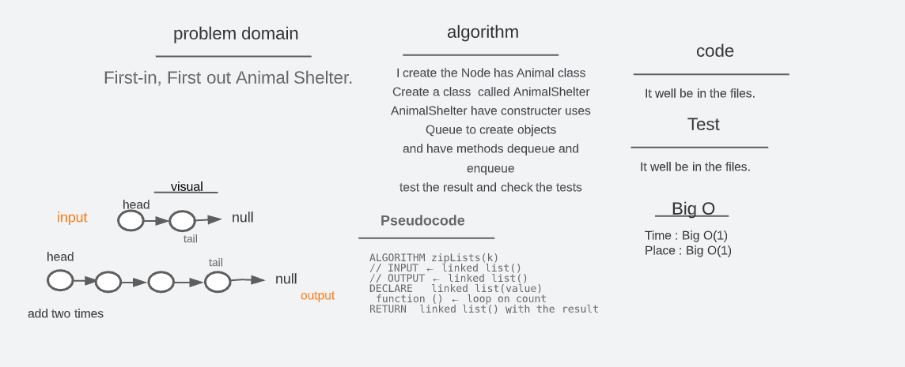
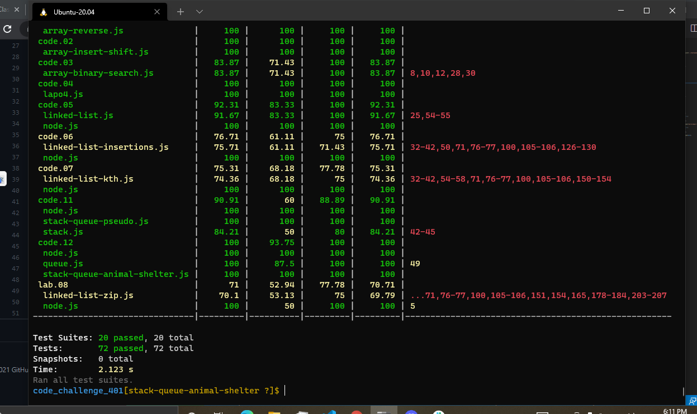

# stack queue animal shelter (lab 12)

[code_challenge_401](https://github.com/mr-atta/code_challenge_401)

### Code Challenge :

- First-in, First out Animal Shelter. >>>> this mean using the queue

 

[github](https://github.com/mr-atta/code_challenge_401/tree/main/code.12)
[code AnimalShelter](https://github.com/mr-atta/code_challenge_401/blob/main/code.12/stack-queue-animal-shelter.js)

 

## Approach & Efficiency

- Read the lab and understand the problem domain "Implement a Queue using two Stacks."

- Thinking and search how to solve and deal with this issue

- Start writing the code

 

- Create a class 'Animal' I will use it in other classes to create our node
- and I create another class called AnimalShelter that has access to another one called Queue.
- The AnimalShelter class has a constructor and method, the constructor will have this.cat is a Queue obj and this.dog is a Queue obj
- and the method enqueue will take a value and it can add a one to the Queue , the method dequeue doesn't take the value and can delete one from the top of the Queue

- Testing the code and check if we can add and delete by enqueue and dequeue methods by comparing the results.

 

## API

### queue

- **enqueue**(value) : adds a new node with that value to the back of the queue with an O(1) Time performance.
- **dequeue**() : Removes the node from the front of the queue

 

## Big O

- enqueue

  - Time : O(1)
  - Space : O(1)

- dequeue
  - Time : O(n)
  - Space : O(n)

 

## Whiteboard Process

 

## test :

 

> Time taken :: 45 min
