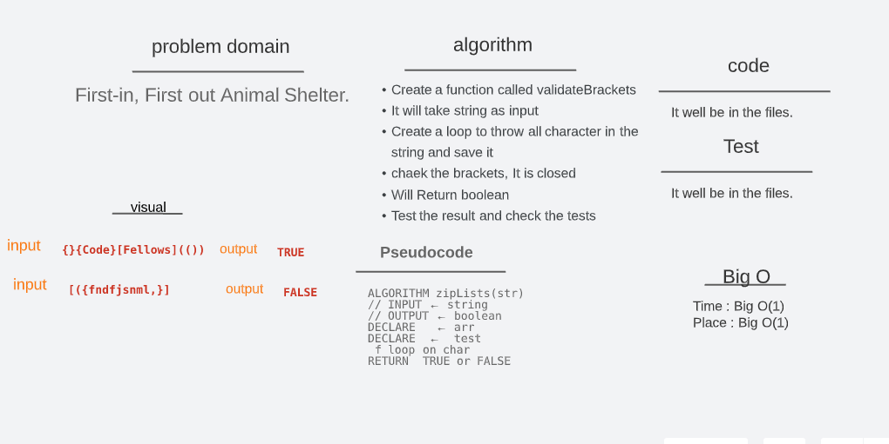

# stack queue brackets ( 13)

[code_challenge_401](https://github.com/mr-atta/code_challenge_401)

### Code Challenge :

- Write a function called validate brackets to check the validation brackets for the input if they are closed brackets??.

 

[github](https://github.com/mr-atta/code_challenge_401/tree/main/code.13)

 

## Approach & Efficiency

- Read the lab and understand the problem domain "Implement a Queue using two Stacks."

- Thinking and search how to solve and deal with this issue

- Start writing the code

 

- Create a function called **validateBrackets** it will take **string** as input and will Return **boolean** .

- and in this function i used for _loop_ to loop each character in the string and _save_ it and then chaek it with brackets by _if else_ .

- Testing the code and check if we can add and delete by enqueue and dequeue methods by comparing the results.

 

## API

## _validateBrackets_ (str)

## _for loop_ if i < str.length (for each char in the str)

## test is var has last char in the arr

## _if else_ like >>> char = [ and return false; if test == "(" or test == "{"

 

## Big O

- Time : O(1)
- Space : O(1)

 

## Whiteboard Process

 

## test :

 

> Time taken :: 30 min
