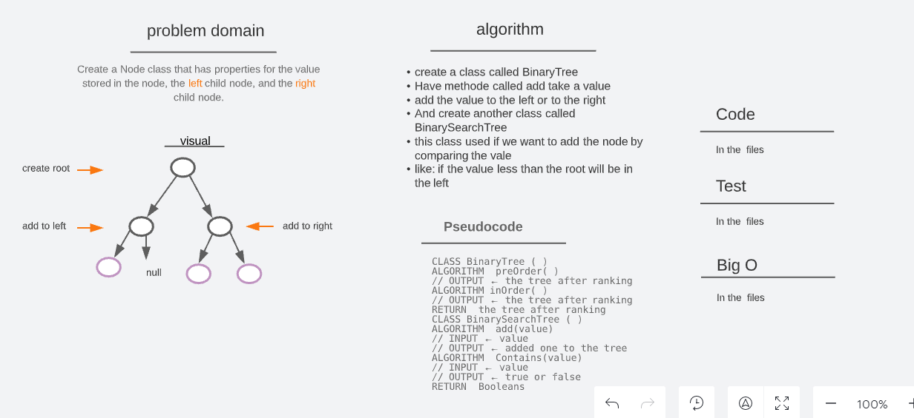
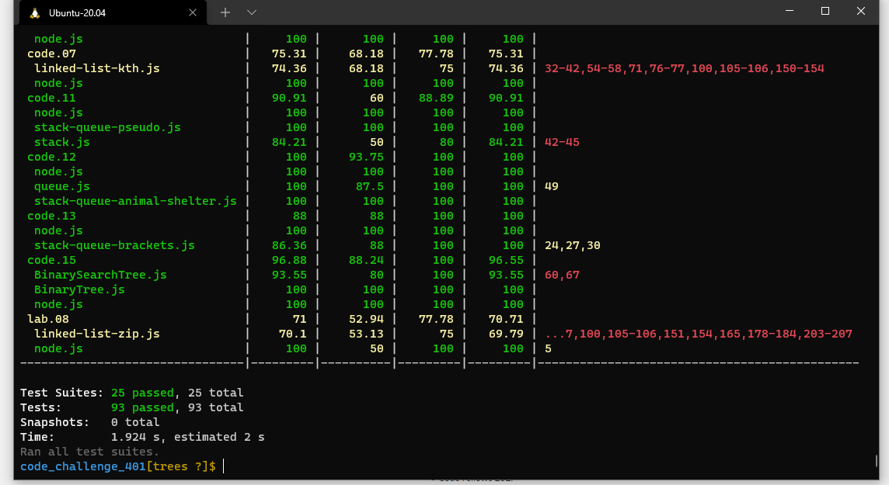
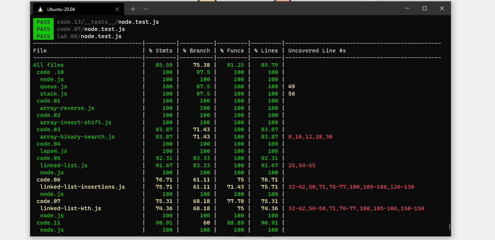

# [🗂️ trees](https://codefellows.github.io/common_curriculum/data_structures_and_algorithms/Code_401/class-15/resources/Trees.html)

## Challenge

> Create a Node class that has properties for the value stored in the node, the left child node, and the right child node.

> Create a Binary Tree class Define a method for each of the depth first traversals: pre order in order post order which returns an array of the values, ordered appropriately.

 
 

## Approach & Efficiency

> Create a Node class that has properties for the value stored in the node, the left child node, and the right child node.

> Create a Binary Tree class, with a method for each of the depth first traversals:

- pre order
- in order
- post order

> Create a Binary Search Tree class (sub-class of the Binary Tree Class), with the following additional methods:

- Add(value), to add a new node with that value in the correct location in the binary search tree.
- Contains(value), to check if we have the value in our binary search tree or not

> test the Binary Tree, and Binary Search Tree

 
 

## API

> you can create a binary tree by added a node root and then added more nodes to the tree on the left or in right.

> you can create a binary search tree by adding a node root and then add a node, the node will be adding to the left if it is less than the root and to the right if it is more than the root.

> you can check by value if it is in the tree you will see true.

 
 

## whitbord

## Big O

- for Binary Tree’s, **Big O time**

  - Inserting a new node `O(n)`
  - Searching for a specific node `O(n)`

- **Big O space** >>> `O(w)`

  - where w is the largest width of the tree

- for Binary Search Tree’s:

  - Time : `O(h)`
    -where h is the largest hight of the tree
  - Space : `O(1)`

 
 

## Test

### Test by : npm test

 
 

### Branch Name

> trees

 

> Time taken :: 50 min
