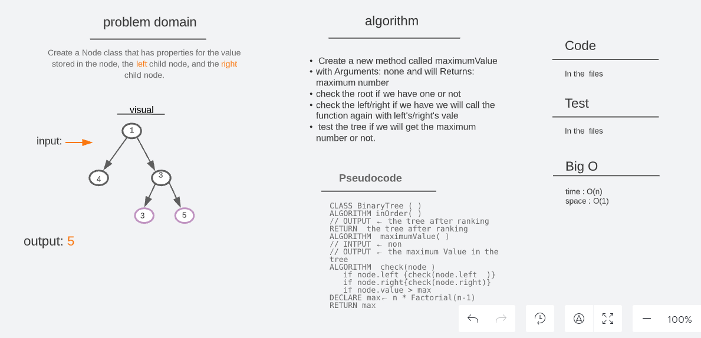
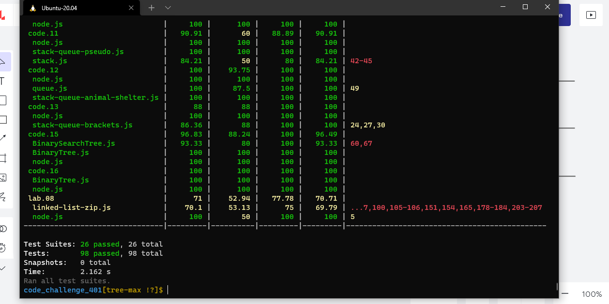

# [🗂️ trees](https://codefellows.github.io/common_curriculum/data_structures_and_algorithms/Code_401/class-15/resources/Trees.html)

## Challenge

> Find the Maximum Value in a Binary Tree

 
 

## Approach & Efficiency

> Create a new method called maximumValue with Arguments: none and will Returns: maximum number in the tree,

> The first thing we will check the root if we have one or not, then check the left if we have we will call the function again with left's vale, and the same thing to the right, After that, if the node's value is greater than the max (root) put node's value in the max.

> The method :

- maximumValue
- pre order
- in order
- post order

> test the tree if we will get the maximum number or not.

 
 

## whitbord

## **Big O time** >>> `O(n)`

## **Big O space** >>> `O(1)`

 
 

## Test

### Test by : npm test

 
 

### Branch Name

> tree-max

 

> Time taken :: 35 min
