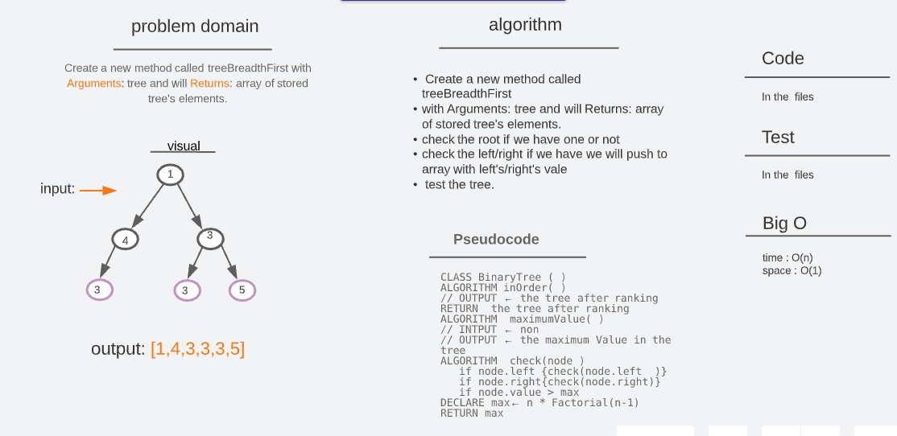
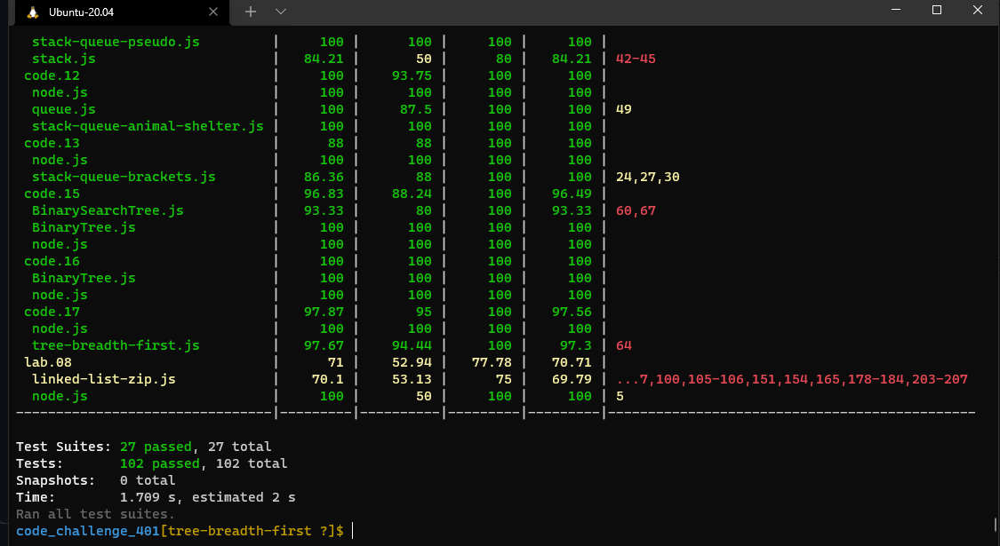
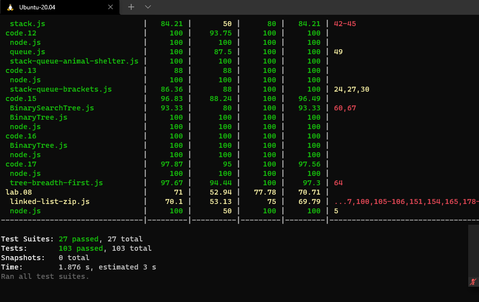

# [🗂️ trees](https://codefellows.github.io/common_curriculum/data_structures_and_algorithms/Code_401/class-15/resources/Trees.html)

## Challenge 17 (Tree Breadth First)

> Write a function called breadth first  
> Arguments: tree  
> Return: list of all values in the tree, in the order they were encountered  

 
 

## Approach & Efficiency

> Create a new method called treeBreadthFirst with Arguments: tree and will Returns: array of stored tree's elements.

> The first thing we will check the root if we have one or not, then check the left if we have we will push to array with left's vale, and the same thing to the right. After that, return the data.

> The method :

- treeBreadthFirst
- pre order
- in order
- post order

> test the tree .

 
 

## whitbord

## **Big O time** >>> `O(n)`

## **Big O space** >>> `O(h)`

 
 

## Test

> input:
> 

> Output: `[2,7,5,2,6,9,5,11,4]`

### Test by : npm test

 
 

### Branch Name

> tree-breadth-first

 

> Time taken :: 35 min
