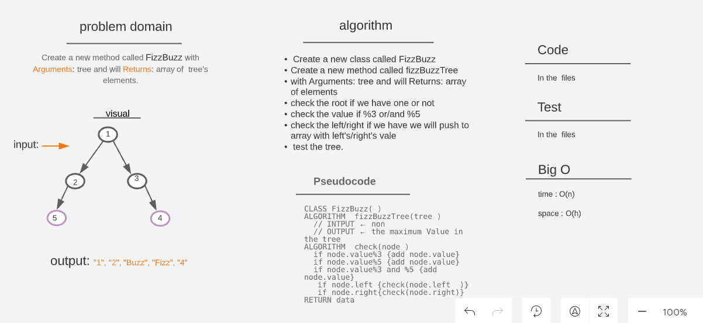
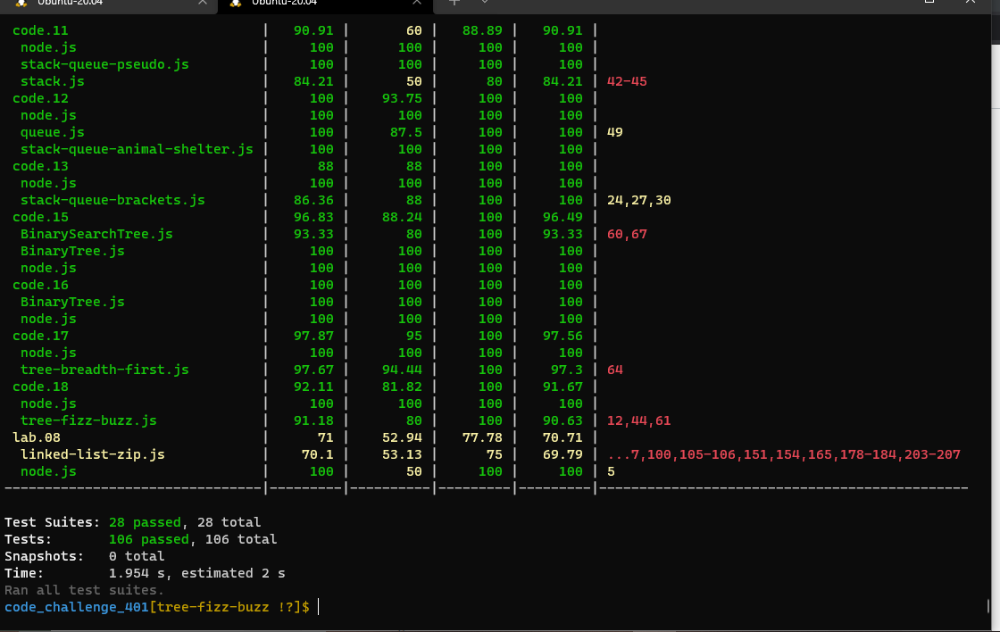

# [🗂️ trees](https://codefellows.github.io/common_curriculum/data_structures_and_algorithms/Code_401/class-15/resources/Trees.html)

## Challenge 18 (Tree-Fizz-Buzz)

> Write a function called fizz buzz tree  
> Arguments: k-ary tree 
> Return: new k-ary tree  

 
 

## Approach & Efficiency

> Create a new class called FizzBuzz. 
> Create a new method called fizzBuzzTree with Arguments: tree and will Returns: array of elements. 
> The first thing we will check the root if we have one or not, then check the left if we have we will push to array with left's vale, and the same thing to the right. After that, return the data. 

> The method :

- fizzBuzzTree

> test the tree .

 
 

## whitbord

## **Big O time** >>> `O(n)`

## **Big O space** >>> `O(h)`

 
 

## Test

### Test by : npm test

 
 

### Branch Name

> `tree-fizz-buzz`

 

> Time taken :: 40 min
