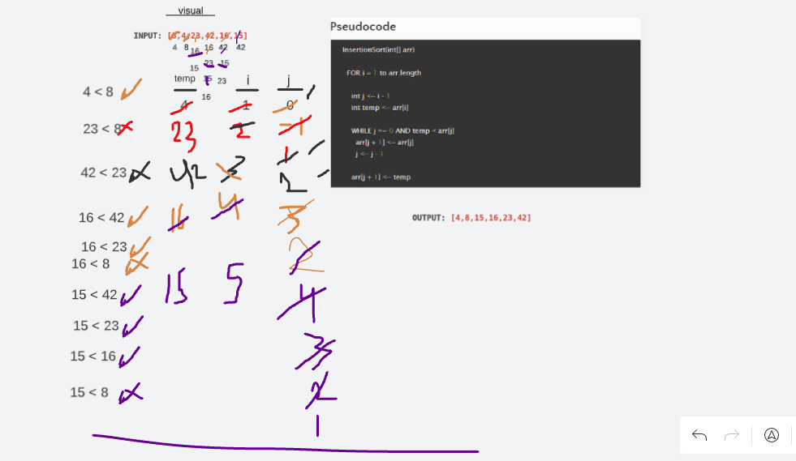
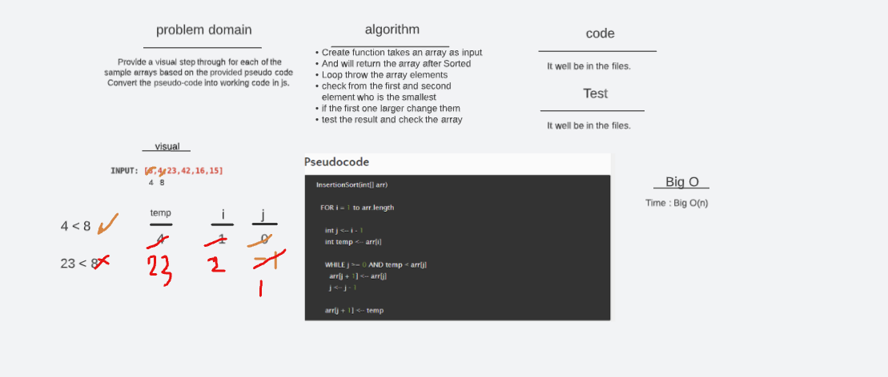
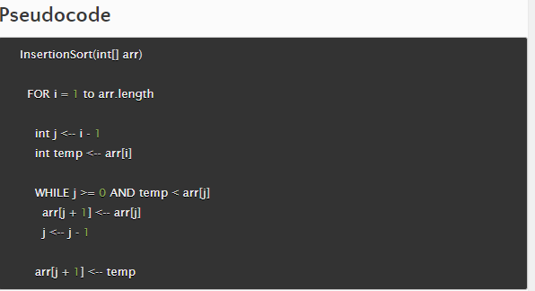
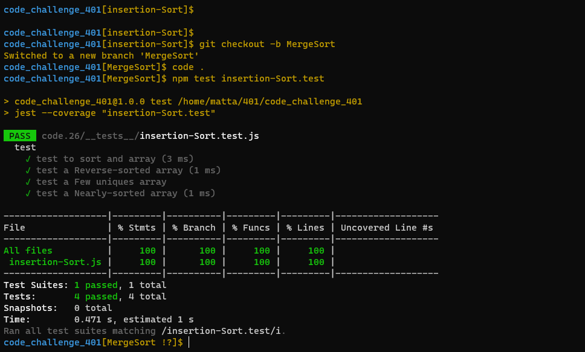

# Challenge 26 (Insertion-Sort)

 

 

### [git hub link](https://github.com/mr-atta/code_challenge_401/tree/main/code.26)

 

## **_tracing_**

## whitbord

<!-- ## **Big O time** >>> `O(n)` -->

<!-- ## **Big O space** >>> `O(h)` -->

 
 

## Test

### Test by : npm test

 
 

### Branch Name

> `insertion-Sort`

 

> Time taken :: 35 min
