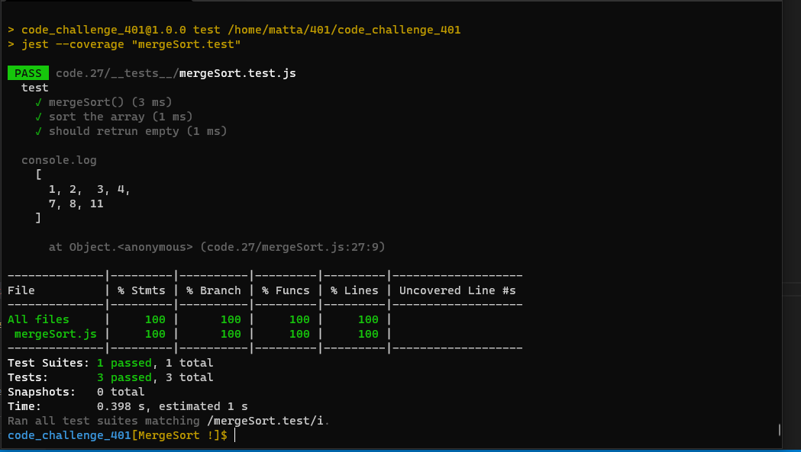

# Challenge 27 (Merge-Sort)

 

 

### [git hub link](https://github.com/mr-atta/code_challenge_401/tree/main/code.27)

 

<!-- ## whitbord -->

<!--  -->

<!--  -->

## **Big O time** >>> `O(n)`

## **Big O space** >>> `O(n)`

 
 

## **_tracing_**

## Test

### Test by : npm test

 
 

### Branch Name

> `MergeSort`

 

> Time taken :: 40 min
