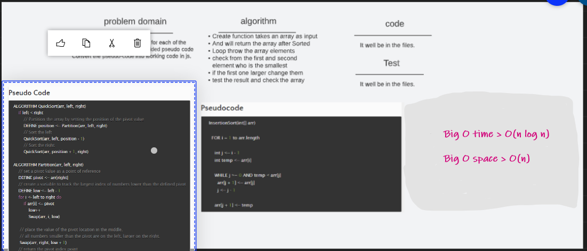

# Challenge 28 (Quick-Sort)

 

### [git hub link](https://github.com/mr-atta/code_challenge_401/tree/main/code.28)

 

## whitbord

<!--  -->

## **_Tracing_**

## **Big O time** >>> `O(n log n)`

## **Big O space** >>> `O(n)`

 
 

## Test

### Test by : npm test

 
 

### Branch Name

> `MergeSort`

 

> Time taken :: 35 min
