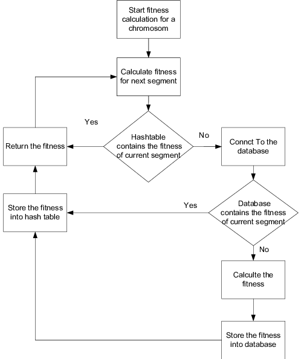
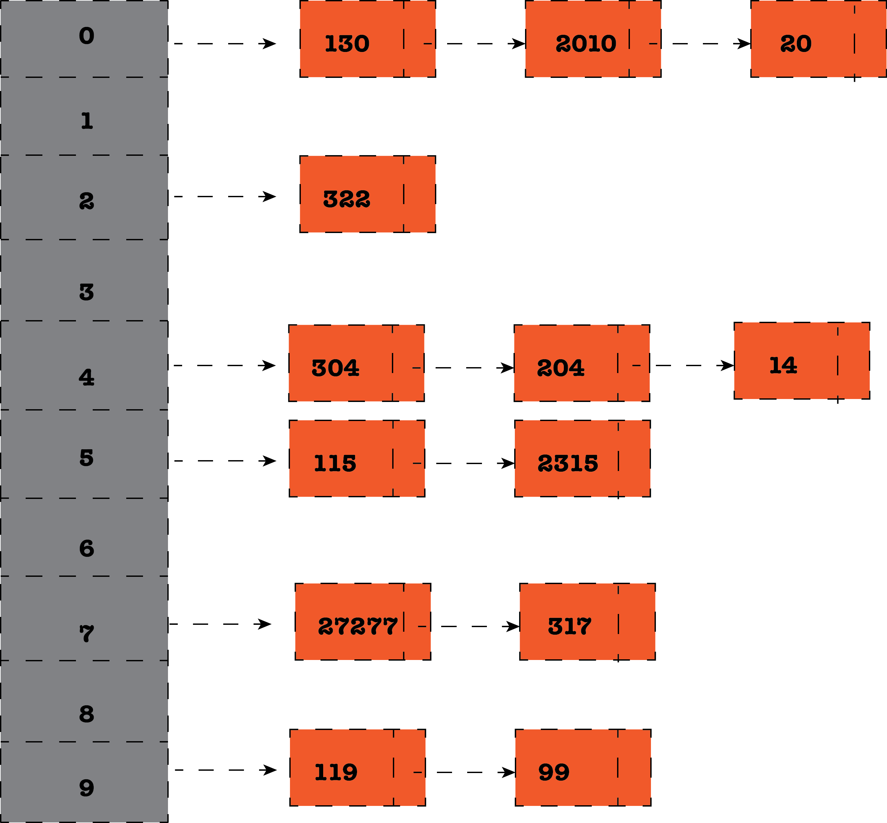
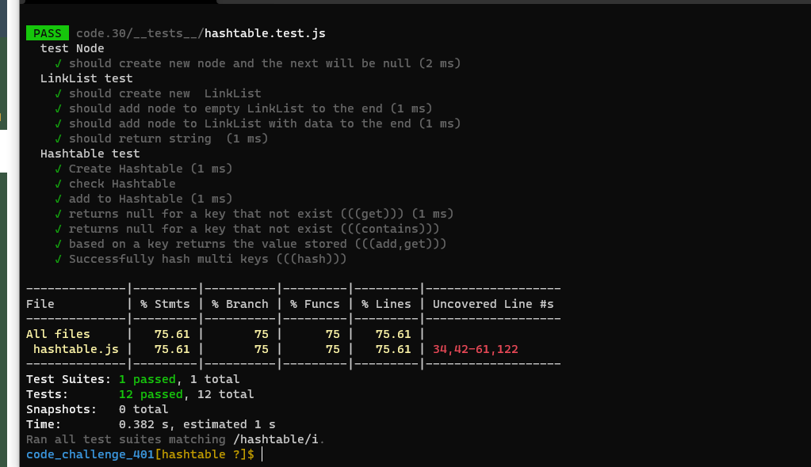

# Challenge 30 (hashtable)

 

## Challenge

> Implement a Hashtable Class with the following methods:

1. add
2. get
3. contains
4. hash

### [git hub link](https://github.com/mr-atta/code_challenge_401/tree/main/code.30)

 

## Approach & Efficiency

create Hashtable class with many methods (function) most of them take the key as input like (hash) and we have a method called add tack key and value as input.
used appropriate algorithms to deal with this type of problem.
some times I avoided declaring unnecessary variables like in return.

## API

### class

- Node
- LL
- Hashtable

### Hashtable methodes

- add
- get
- hash
- contains

 

<!-- ## whitbord

 -->

<!--  -->

## **_Tracing_**

## **Big O time** >> to search >> `O(1)`

## **Big O space** >>> `O(1)`

 
 

## Test

### Test by : npm test

 
 

### Branch Name

> `hashtable`

 

> Time taken :: 60 min
