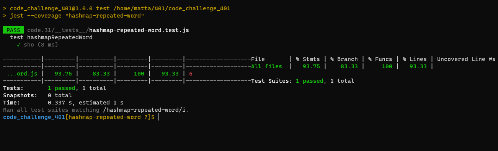

# Challenge 31 (hashmap-repeated-word)

 

## Challenge

> Find the first repeated word in a book.

### [git hub link](https://github.com/mr-atta/code_challenge_401/tree/main/code.31)

 

## Approach & Efficiency

create function called `hashmapRepeatedWord` take the string as input and we will loop throw the string's words and return the Repeated Word.
used appropriate algorithms to deal with this type of problem.
some times I avoided declaring unnecessary variables like in return.

### Tasks

> Write a function called repeated word that finds the first word to occur more than once in a string  
> Arguments: string  
> Return: string  

 

<!-- ## whitbord

 -->

<!--  -->

## **_Tracing_**

## **Big O time** >> to search >> `O(n^2)`

## **Big O space** >>> `O(1)`

 
 

## Test

### Test by : npm test

 
 

### Branch Name

> `hashmap-repeated-word`

 

> Time taken :: 35 min
