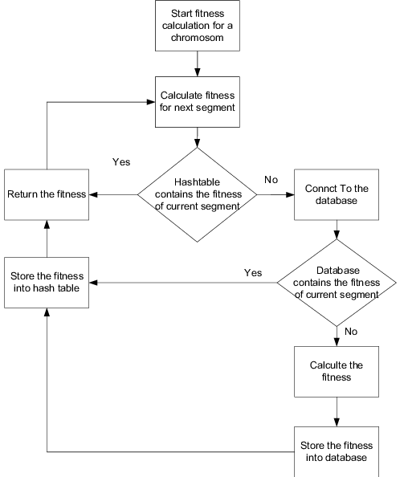

# Challenge 30 (hashtable)

 

## Challenge

> Find common values in 2 binary trees.

- Write a function called tree intersection
- Arguments: two binary trees
- Return: array

### [git hub link](https://github.com/mr-atta/code_challenge_401/tree/main/code.32)

 

## Approach & Efficiency

> create method called `hashmapTreeIntersection` with 'two binary trees' as input and Return >> array have all values found to be in 2 binary trees .  

> used appropriate algorithms to deal with this type of problem.
> some times I avoided declaring unnecessary variables like in return.

<!-- ## API -->

### class

- Node
- LL
- Hashtable

### Hashtable methodes

- add
- get
- hash
- contains
- hashmapTreeIntersection

 

 <!-- ## whitbord -->

<!--  -->

<!-- ## **_Tracing_**

 -->

## **Big O time** >> to search >> `O(n)`

## **Big O space** >>> `O(1)`

 
 

## Test

### Test by : npm test

 
 

### Branch Name

> `hashmap-tree-intersection`

 

> Time taken :: 35 min
