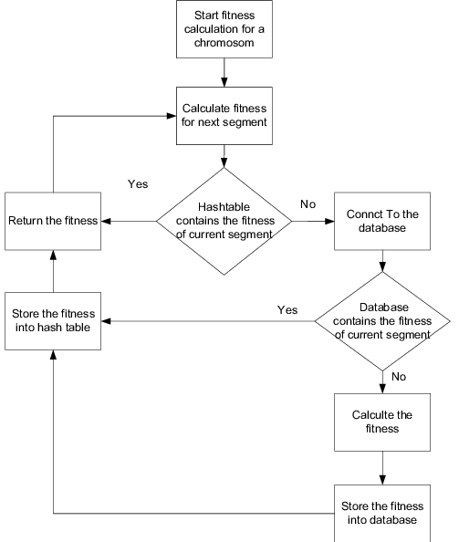

# Challenge 33 (Left-Join)

 

## Challenge

> Implement a simplified LEFT JOIN for 2 Hashmaps.

- Write a function called left join
- Arguments: two hash maps

### [git hub link](https://github.com/mr-atta/code_challenge_401/tree/main/code.33)

 

## Approach & Efficiency

> create method called `leftJoin` with 'two hash table' as input and Return >> ???????.  

> used appropriate algorithms to deal with this type of problem.
> some times I avoided declaring unnecessary variables like in return.

<!-- ## API -->

### class

- Node
- LL
- Hashtable

### Hashtable methodes

- add
- get
- hash
- contains
- leftJoin

 

 <!-- ## whitbord -->

<!--  -->

<!-- ## **_Tracing_**

 -->

## **Big O time** >> to search >> `O(n)`

## **Big O space** >>> `O(n)`

 
 

## Test

### Test by : npm test

 
 

### Branch Name

> `Left-Join`

 

> Time taken :: 40 min
