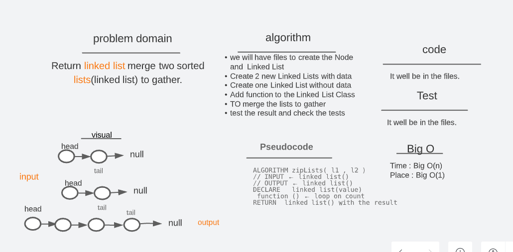
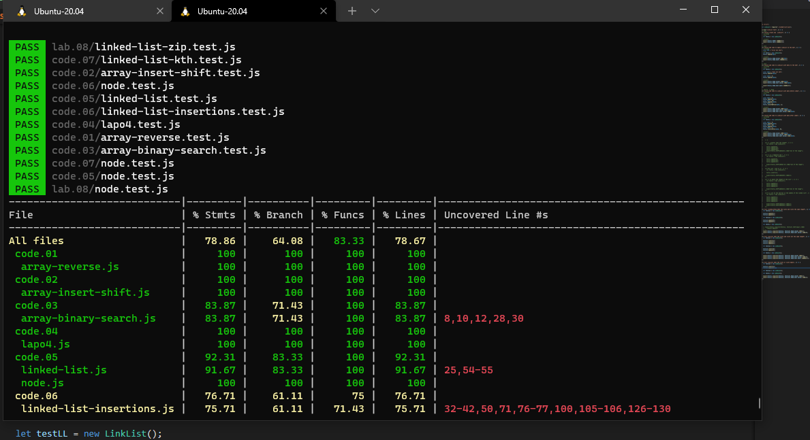

# linked-list-kth (lab 07)

## Challenge

- Merge(zip) two sorted lists(linked list) to gather.

## Whiteboard and Process

## test code

## Approach & Efficiency

- Within your Linked List create two List of data to work on it
- create function zip lists, take two Linked List as parameter
- return the Linked Lis has the merge of two lists
- Do tests to check the code
